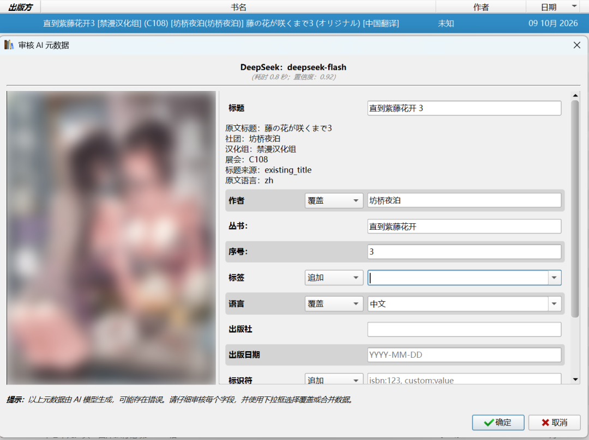

<div align="center">
  

  # 漫元 · MetaManga
</div>

用于 Calibre 的漫画 AI 元数据插件：文件名解析 · AI 识别 · 标题翻译 · 批量处理 · 审核编辑

本项目基于 [RelUnrelated/calibre-ai-vision-metadata](https://github.com/RelUnrelated/calibre-ai-vision-metadata) 二次开发，保留原项目的 GPL-3.0 许可证和内部配置兼容性，并在此基础上补齐了中文界面、多语言标题翻译、漫画文件名解析和逐本审核编辑等功能。

## 项目简介

漫元是一个用于 Calibre 的 AI 元数据插件，直接读取文件名，并结合现有书籍元数据提取漫画标题、作者、丛书、卷号、语言和备注，在需要时翻译标题。

插件只发送文件名和元数据文本，不上传或分析封面图片。中文标题优先保留；日语、英语、韩语以及混合语言标题可以交给配置的 AI 翻译为简体中文。

## 主要功能

- 支持 Google Gemini、OpenAI、DeepSeek、Anthropic、OpenRouter，以及 Ollama / LM Studio 本地模型。
- 支持日语、英语、韩语和多语言混合标题识别与中文翻译。
- 从文件名和 Calibre 元数据中识别标题、作者、社团、翻译组、丛书、卷号、章节和备注。
- 支持批量分析、后台逐本处理、自动应用和逐本审核。
- 逐本审核窗口可以编辑标题、作者、丛书、序号、标签、语言、出版社、出版日期、标识符和备注。
- 兼具元数据编辑器功能：不依赖 AI 分析，可以直接在审核窗口手动编辑漫画元数据，逐字段选择覆盖或追加。
- 标签下拉列表读取当前 Calibre 书库正在使用的标签。
- 保留原始标题、原始文件名和分析记录，方便复核和恢复。
- 内置基于 Kavita 命名规则的卷号、章节号和范围识别逻辑。

## 界面截图



## 安装

1. 从 [Releases](https://github.com/ZongPou/calibre-metamanga/releases) 页面下载最新的插件 ZIP 包，不要解压。
2. 打开 Calibre，进入“首选项 → 插件”。
3. 点击右下角“从文件加载插件”，选择该 ZIP 文件。
4. 确认安全提示并重启 Calibre。

## 配置

进入“首选项 → 插件”，找到“漫元 (MetaManga)”，双击打开配置窗口。

1. **AI 提供商：** 选择 Google Gemini、OpenAI、DeepSeek、Anthropic、OpenRouter 或本地模型。
2. **API 密钥 / 本地地址：** 云端服务填写 API 密钥；本地模型填写地址，例如 `http://localhost:11434`。
3. **模型：** 点击“获取可用模型”读取模型列表。
4. **提示词：** 可以为每个 AI 提供商单独编辑系统提示词。
5. **点击插件时直接应用 AI 元数据：** 勾选后直接写入结果；不勾选时进入审核流程。
6. 点击“应用”或“确定”保存。

API 密钥保存在 Calibre 用户配置目录中，不会写入插件 ZIP 或 GitHub 源码。Windows 默认位置通常是：

```text
%APPDATA%\calibre\plugins\metamanga.json
```

插件的配置文件为 `metamanga.json`。首次使用新版插件时，会自动将旧配置文件 `ai_vision_metadata.json` 中的 API 密钥、模型、提示词和设置复制到 `metamanga.json` 中；已有的非空配置不会被覆盖，旧文件保留作为备份。

## 使用方法

1. 在 Calibre 书库中选择一本或多本书。
2. 点击工具栏中的“漫元 MetaManga”，或从右键菜单启动插件。
3. 插件会在后台逐本分析文件名和元数据文本。
4. 自动模式会在验证通过后写入支持的字段。
5. 逐本审核模式会显示 AI 建议和现有元数据，可以直接编辑后保存。窗口布局和各字段说明见上方“界面截图”。

## AI 服务

- [Google AI Studio](https://aistudio.google.com/app/apikey)：创建 Gemini API 密钥。
- [OpenAI Platform](https://platform.openai.com/api-keys)：创建 OpenAI API 密钥。
- [DeepSeek API Keys](https://platform.deepseek.com/api_keys)：创建 DeepSeek API 密钥。默认关闭思考模式以降低处理时间。
- [Anthropic Console](https://console.anthropic.com/settings/keys)：创建 Claude API 密钥。
- [OpenRouter](https://openrouter.ai/settings/keys)：创建 OpenRouter API 密钥并访问多个模型提供商。
- [Ollama](https://ollama.com/) / [LM Studio](https://lmstudio.ai/)：在本机运行模型，插件只发送文本。

## 许可证

漫元 MetaManga 基于 [RelUnrelated/calibre-ai-vision-metadata](https://github.com/RelUnrelated/calibre-ai-vision-metadata) 修改而成，原作者为 RelUnrelated（dan@relunrelated.com）。

本项目包含大量修改，遵循 [GPL-3.0](https://www.gnu.org/licenses/gpl-3.0.html) 许可证发布。本程序按“现状”提供，不含任何担保；您可以在许可证条款下自由使用、修改和再分发。完整的许可证文本见 [LICENSE.md](LICENSE.md)。

## 致谢

- [RelUnrelated/calibre-ai-vision-metadata](https://github.com/RelUnrelated/calibre-ai-vision-metadata)：本项目的基础，AI 元数据识别的核心架构来自上游项目。
- [Kavita](https://github.com/Kareadita/Kavita)：开源漫画/图书阅读器，卷号、章节号和范围识别规则参考其实现并根据漫画文件命名习惯适配，仅做选择性规则适配，不包含完整的 Kavita 扫描器；详见 `THIRD_PARTY_NOTICES.md`。
- [Calibre](https://calibre-ebook.com/)：优秀的开源电子书管理软件，本插件基于其插件框架开发。
- 各 AI 服务提供商（Google Gemini、OpenAI、DeepSeek、Anthropic、OpenRouter）及 [Ollama](https://ollama.com/) / [LM Studio](https://lmstudio.ai/) 社区。
